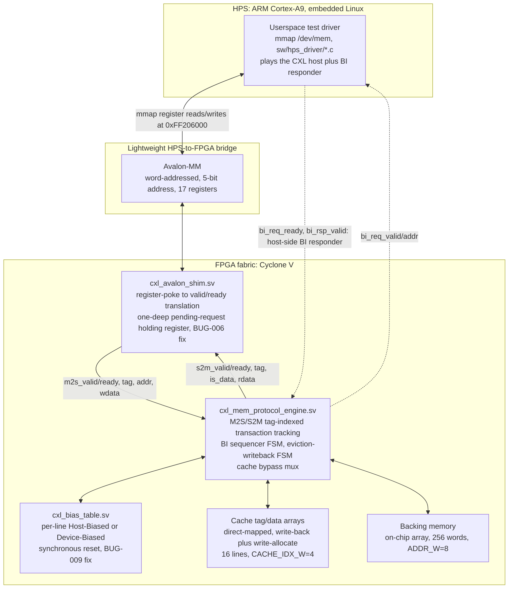

# CXL-Lite Memory-Side Cache

A protocol-level model of a CXL.mem memory-side cache (Type 3 device style), built from
simulation through to a real FPGA + embedded-Linux hardware port on a Terasic
DE10-Standard (Cyclone V, `5CSXFC6D6F31C6`). Originally scoped as sim-only
(`CXL_Lite_Memory_Side_Cache_Manual.md`); extended through this project's own hardware
bring-up, phase by phase, with every phase gate re-verified on real silicon, not just in
Verilator.

**Status: all 8 core phases (0 through 8) done, sim-verified and hardware-verified.**
See `FPGA_Implementation_Roadmap.md` for the full phase-by-phase log.

---

## Architecture



Every arrow above is a real, currently-passing test, not an aspirational diagram — see
`FPGA_Implementation_Roadmap.md`'s per-phase "Hardware bring-up results" sections for the
exact commands and output.

---

## The bias mechanism + BI handshake (the coherence core of this project)

*(Carried over from the original manual's Part 1.4, unchanged — this framing is still the
best "do you understand coherence" artifact in the project. RTL pointers added.)*

Every line of device-attached memory is, at any moment, in one of two **bias** states:

- **Host Bias:** the host may have a cached copy of this line. The device must not service
  a read/write for this line out of its own memory-side cache without first checking with
  the host.
- **Device Bias:** the host does not have a cached copy. The device is free to access,
  cache, and modify this line locally without host involvement — the fast path, and the
  whole reason bias exists: most accesses should never need a round trip to the host.

**Switching bias** (Host Bias → Device Bias) requires the device to issue a
**Back-Invalidate (BI) request** to the host, asking it to drop/writeback any cached copy,
and wait for the host's **BIRsp** before the device can safely take local ownership. This
handshake is directly analogous to a directory-based coherence protocol's invalidate/ack
sequence, scoped down to two parties instead of N.

**Where this lives in the RTL:**
- Bias state: `rtl/cxl_bias_table.sv` — one bit per address, dual independent read ports
  (a debug port for software, and a query port the BI sequencer checks every cycle).
- The BI sequencer FSM: `rtl/cxl_mem_protocol_engine.sv`, `bi_state_t` (`BI_IDLE` →
  `BI_REQ` → `BI_WAIT_RSP` → back to `BI_IDLE`), triggered by
  `want_bi = (bi_state==BI_IDLE) && m2s_valid && bias_query_rd_data`.
- **The coherence invariant is enforced structurally, not by a runtime check**: bias gating
  happens *before* the cache logic in the accept path
  (`m2s_ready = ... && !bias_query_rd_data && ...`), so a Host-Biased request can never
  physically reach the cache-allocate logic at all — "never cache a Host-Biased line" is
  true by construction, one phase upstream, not something the cache re-checks. See
  `COVERAGE_REPORT.md` §2 for why this means that specific cross-coverage cell doesn't need
  a test to fill it.
- Verified: `sim/phase4` (including a write-triggered BI transition, added while writing
  `COVERAGE_REPORT.md` — see that file for why), `sim/phase4h`, and on real hardware via
  `sw/hps_driver/host_driver_linux_phase234h.c`, where the driver itself plays the
  host-side BI responder.

---

## Results at a glance

Every number below is pulled directly from a report file or a real hardware run — not
estimated. Sources are named so they can be checked against the repo.

### Timing closure (`quartus/output_files/CXL_DE10_Standard.sta.summary`, final build)

Worst-corner (Slow 1100mV 85°C model), the design's own clock domain:

| | Setup slack | Hold slack | TNS |
|---|---|---|---|
| `CLOCK_50` | **6.582 ns** | **0.280 ns** | 0.000 |

**No negative slack anywhere in the design**, across every corner and domain `quartus_sta`
checked (Slow/Fast × 1100mV × 0°C/85°C, all clock domains) — checked directly, not assumed.
`CLOCK_50` setup slack shrank across the project as combinational depth grew, always staying
comfortably positive: **9.096 ns** (pre-cache, Phase 2H/3H/4H build) → **6.588 ns** (post-cache,
Phase 5H/6H build) → **6.582 ns** (final, post-bypass-mux, Phase 8 build).

### FPGA resource utilization (`quartus/output_files/CXL_DE10_Standard.fit.summary`, final build)

| Resource | Used | Available | % |
|---|---|---|---|
| Logic (ALMs) | 8,189 | 41,910 | 20% |
| Registers | 14,151 | — | — |
| Pins | 338 | 499 | 68% |
| Block memory bits | 2,816 | 5,662,720 | <1% |
| RAM blocks (M10K) | 6 | 553 | 1% |
| DSP blocks | 0 | 112 | 0% |
| PLLs | 0 | 15 | 0% |
| DLLs | 1 | 4 | 25% |

Whole `soc_system` (HPS bridge infrastructure included) plus the CXL-Lite logic together —
this project's own RTL (`cxl_avalon_shim`, `cxl_mem_protocol_engine`, `cxl_bias_table`) is a
small fraction of the 20% ALM figure; the HPS SDRAM controller and bridge fabric account for
most of it. Zero DSP blocks used — this design is pure control/FSM/mux logic and array
lookups, no arithmetic datapath, consistent with the timing-closure audit in
`FPGA_Implementation_Roadmap.md` finding nothing worth pipelining.

### Sim coverage (`COVERAGE_REPORT.md`)

**90/150 (60.00%)** Verilator line/toggle coverage, merged across all 7 engine-level
testbenches. The more meaningful number is the hand-curated functional cross-coverage table
in that file — every `access_type × bias_state_before × bias_state_after` and
`cache_result × bias_state` cell mapped to a specific named test, which is how a real gap
(write-triggered BI had never been tested) was found and fixed, not just a percentage.

### Cache correctness — hardware-measured hit/miss counters

Not simulated: these are the actual `CACHE_HITS`/`CACHE_MISSES` register values read back
over the Avalon bridge during real hardware test runs.

| Test | `hits` | `misses` | Source |
|---|---|---|---|
| Phase 5H/6H full run (allocate/hit/evict/thrash) | +2 | +13 | `host_driver_linux_phase56h.c` |
| Phase 7 Stress 3: 24-line working set vs. 16-line cache | +8 | +40 | `host_driver_linux_phase7.c` |
| Phase 8: 2000 reads, cache enabled | +2000 | +0 | `host_driver_linux_phase8.c` |
| Phase 8: 2000 reads, `CACHE_BYPASS` enabled | +0 | +2000 | `host_driver_linux_phase8.c` |

The 24-vs-16 result (misses genuinely dominating a working set larger than cache capacity)
and the clean 2000/0 vs. 0/2000 split under bypass are both exactly what the RTL's control
logic should produce if it's correct — and are asserted as exact deltas in the test code,
not eyeballed.

### Max-outstanding-request stress (Phase 7)

All **16** possible tags (`NUM_TAGS`, `TAG_W=4`) fired without draining any of them, then
drained together: **16/16** responses correctly routed, **zero** phantom completions
(a response for a tag never fired), **zero** duplicates.

### Phase 8: the cache-on-vs-off latency experiment (N=2000 accesses each)

Measured with `clock_gettime(CLOCK_MONOTONIC)` — a real hardware timer (ARM generic timer
via the VDSO), not a software counting loop:

| | avg | min | max | stddev |
|---|---|---|---|---|
| Cache **ON** (hit) | 3236.3 ns | 3170.0 ns | 56470.0 ns | 1190.7 ns |
| Cache **OFF** (`CACHE_BYPASS`) | 3233.9 ns | 3190.0 ns | 42580.0 ns | 880.2 ns |

**Difference: -2.4 ns average** — smaller than the ~1035 ns pooled measurement noise, i.e.
**not statistically significant**. This is the honest result, not a failed one: the cache's
real RTL-level saving is `READ_EXTRA_LATENCY=3` cycles @ 50MHz = **60 ns**, dwarfed by the
**~3.2 microsecond** fixed cost of a software-driven Avalon-MM round trip through mmap'd
`/dev/mem` and the Lightweight HPS-to-FPGA bridge — a cost that applies identically to hits
and misses, so it cannot distinguish them. See the Phase 8 section of
`FPGA_Implementation_Roadmap.md` for the full methodology and reasoning.

---

## Hardware bring-up: what actually happened

The short version — full detail, exact commands, and raw output are in
`FPGA_Implementation_Roadmap.md` and `bugs.md`:

- **Every phase (2H through 8) is verified on real silicon**, not just in sim, including
  the full BI handshake, cache hit/miss/evict with exact counter-delta assertions, and a
  cache-bypass mode built specifically for the Phase 8 latency experiment.
- **The hardest bug in the project wasn't in the RTL.** Every board hang traced to one
  cause (`bugs.md` BUG-010): JTAG configuration is volatile, so after any power cycle the
  FPGA fabric is unconfigured while the HPS-to-FPGA bridge stays *enabled* — and an MMIO
  access into an unconfigured fabric stalls the ARM core uninterruptibly. It took four
  power cycles and one wrong turn (BUG-009 — a real bug, correctly fixed, but not the
  actual cause) to find. The fix became procedure: **every hardware test driver in
  `sw/hps_driver/` arms `/dev/watchdog` before its first MMIO access**, turning a future
  wedge into an automatic 20-second self-reset instead of a physical power cycle.
- **Phase 8's result is a deliberately honest null result, not a manufactured percentage.**
  The cache's real RTL-level latency saving is 60ns (`READ_EXTRA_LATENCY=3` cycles @
  50MHz); measured through a software-driven register-poke interface over mmap'd
  `/dev/mem`, the fixed per-access overhead is ~3.2 microseconds — too large to resolve a
  60ns effect underneath it. The cache's correctness *and* its RTL-level latency benefit
  are both independently verified elsewhere; what this specific experiment demonstrates is
  a measurement-resolution limit, and it says so. See `FPGA_Implementation_Roadmap.md`
  Phase 8 for the full methodology and numbers.

---

## What I deliberately did not model

Same scope discipline the original manual applies to itself, extended for the hardware
port:

- **No real CXL PHY / PCIe electricals** — impossible on this silicon, and not where the
  interview signal is; this project is the transaction-level protocol/cache logic that
  sits *above* the PHY.
- **Backing memory is on-chip BRAM, not real DRAM or a remote CXL tier.** A deliberate
  simplicity choice (Phase 0), not a limitation of the board — and it's the direct reason
  Phase 8's latency experiment couldn't resolve a difference: a real memory-side cache's
  value is largest exactly when backing memory is slow, which on-chip BRAM isn't.
- **No embedded/bare-metal HPS boot from power-on.** The HPS runs a pre-existing Linux
  image from SD card; hardware test drivers are Linux userspace programs
  (`mmap(/dev/mem)`), not a bare-metal application. A bare-metal driver skeleton exists in
  `sw/hps_driver/` (`host_driver.c`/`startup.s`/`linker.ld`) from before this was known,
  kept for a possible future from-power-on boot path, but unused by the current bring-up.
- **No multi-host/switch topologies, no CXL.io or CXL.cache** — out of scope for a
  single-host, single-device Type-3-style model.
- **Host-initiated (Device→Host) bias transitions are not a modeled protocol path.** Only
  device-initiated BI (device wants a Host-Biased line → asks host to invalidate) is
  implemented, matching the manual's own scoping. The debug-only `BIAS_SET` register can
  force a line Host-Biased directly for testing, but doing so does **not** invalidate any
  existing device-side cached copy — a real, documented, intentionally-out-of-scope
  coherence gap in that debug path specifically (`bugs.md` BUG-011), not in the modeled
  protocol.
- **No SD-card standalone boot** (preloader + U-Boot + `.rbf`) — the reference `de10_ghrd`
  project has a working flow to crib from if this becomes worth doing; JTAG programming +
  the already-running Linux image was sufficient for every phase gate in this project.

---

## Reproducing this from a clean checkout

**Toolchain:** Quartus Prime Lite 21.1 (`C:\intelFPGA_lite\21.1\quartus`), targeting
`5CSXFC6D6F31C6`. Verilator (via WSL2) for simulation, cross-checked with native Windows
Icarus Verilog. GCC on the HPS's Linux image for the hardware test drivers.

**Simulation** (from `sim/phaseN/`, N = 1,2,3,4,5,6,8; 1h,3h,4h,8 are the Avalon-shim-level
variants):
```bash
bash run.sh          # engine-level testbenches
bash run_shim.sh      # phase8 only: the CACHE_BYPASS register-level test
```
All 11 suites pass clean; see `COVERAGE_REPORT.md` for line/toggle coverage and a
hand-curated functional cross-coverage table.

**Quartus build + program**, from `quartus/`:
```bash
bash build_all.sh     # qsys-generate -> quartus_map -> HPS SDRAM pin assignments
                       # -> quartus_cdb --merge -> quartus_fit -> quartus_asm -> quartus_sta
# then, after READING the timing summary (output_files/*.sta.summary) and confirming
# no negative slack -- never skip this step:
"C:/intelFPGA_lite/21.1/quartus/bin64/quartus_pgm.exe" --mode=jtag \
    -o "p;output_files/CXL_DE10_Standard.sof@2"
```

**Hardware tests**, after flashing (per `bugs.md` BUG-010, always in this order):
1. Confirm the fabric is actually configured with a watchdog-protected read:
   `sw/hps_driver/safe_probe.c` (compile with `gcc`, run on the HPS).
2. Then run the phase-specific driver, e.g. `host_driver_linux_phase234h.c` (2H/3H/4H),
   `host_driver_linux_phase56h.c` (5H/6H), `host_driver_linux_phase7.c` (stress/edge
   cases), `host_driver_linux_phase8.c` (the latency experiment).

---

## Where everything else lives

- `FPGA_Implementation_Roadmap.md` — the master phase-by-phase log: architecture
  decisions, exact hardware bring-up commands and output, gate results.
- `bugs.md` — every bug found, sim or hardware, including the two headline stories at the
  top of the file.
- `interview_questions.md` — per-phase Q&A, written for actually explaining this project
  out loud, including the BUG-010 hardware-debugging narrative and the Phase 8 honest-null-
  result reasoning.
- `COVERAGE_REPORT.md` — Verilator line/toggle coverage plus the hand-curated functional
  cross-coverage table this project actually trusts more, and the one real gap it found
  (and fixed).
- `CXL_Lite_Memory_Side_Cache_Manual.md` — the original sim-only manual this project
  started from.
